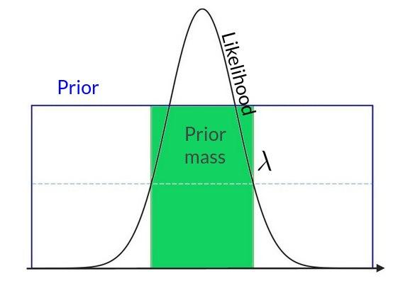
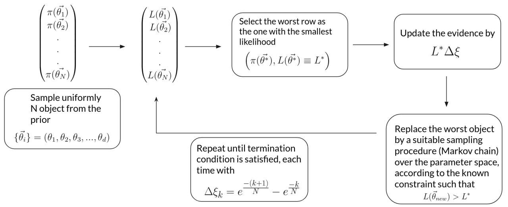
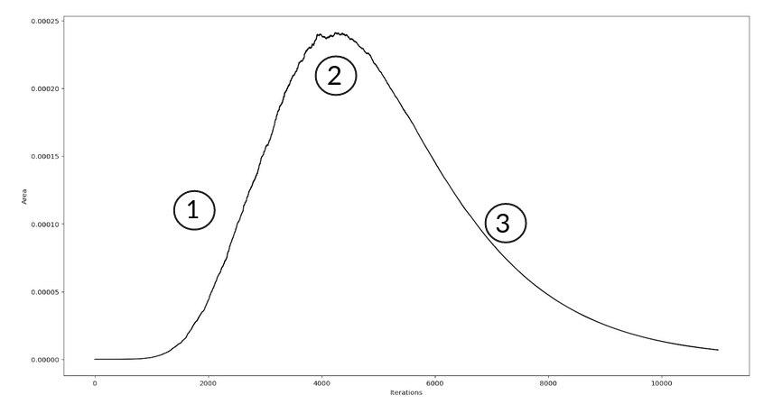
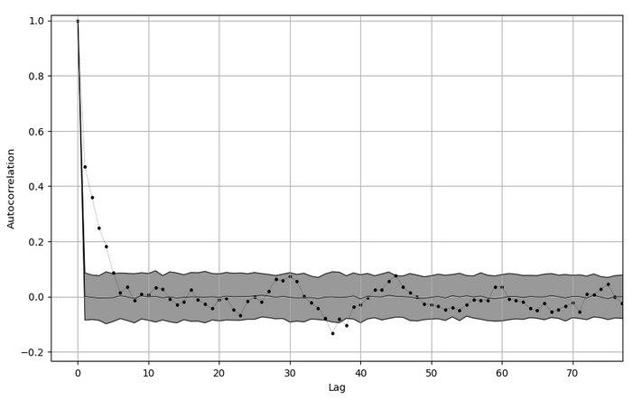

Guidelines
==========
Here there is a fast overview of the theory behind the algorithm, the challanges that I have encountered during the implementation and how I faced them. It is not meant to be a sophisticated or even correct treatment, since the project's scope was a university exam (Introduction to Bayesian Probability Theory by professor Walter Del Pozzo, University of Pisa) and the problem at hand is very difficult. It was not required to obtain exact results. If I will help someone to get an idea of how to handle the problem, I will be happy. Other information can be found in the slides updated into the repository.

Brief Introduction
------------------

Nested Sampling is an algorithm aimed to evaluate the evidence in the Bayes' Theorem

.. math::
    P(H|DI)=\frac{P(H|I)P(D|HI)}{P(D|I)}=\frac{P(H|I)P(D|HI)}{\sum_i P(H_i|I)P(D|H_iI)}

where :math:`H` is the hypothesis that explain some phenomenon, :math:`D` are the data registered and :math:`I` is the background information. Keep in mind that usually we can not compute directly the sum over all the possibile hypothesis that explain our phenomenon because they aren't mutually exclusive (and we don't have the power to enumerate all of them!). Using the usual names that can be found in the literature

.. math::
    Posterior=\frac{ Prior \times Likelihood}{Evidence}

Evidence is one of the most important quantites of the Bayes Probability Theory since it enters in the computattion of the so-called Odds Ratio between two competing hypothesis :math:`H_1` and :math:`H_2`.

.. math::
    \frac{P(H_1|DI)}{P(H_2|DI)}=\frac{P(H_1|I)}{P(H_2|I)}\frac{P(D|H_1I)}{P(D|H_2I)}=\Pr ior\ Odds\times Bayes\ Factor

Odds Ratio reduces to the Bayes Factor when we do not have any prior information that can favors one hypothesis over the other (we have to be fair). Then, writing the Bayes Theorem for the set of parameters on which :math:`H_1` and :math:`H_2` depend, Bayes Factor becames the ratio between the evidence of the two set of parameters (note that the integrals are actually the ratio of the likelihoods by marginalization)

.. math::
    B_{12}=\frac{\int_{\Theta_1}^{ }d\vec{\theta_1}P(\vec{\theta_1}|H_1I)P(D|\vec{\theta_1}H_1I)}{\int_{\Theta_2}^{ }d\vec{\theta_2}P(\vec{\theta_2}|H_2I)P(D|\vec{\theta_2}H_2I)}

General Idea
------------

We end up with the problem of computing a multidimensional integral of this form

.. math::
    Z=\int_{ }^{ }\int_{ }^{ }...\int_{ }^{ }L(\vec{\theta})\pi(\vec{\theta})d\vec{\theta}

The main idea to image to change variable in such a way that

.. math::
    \pi(\vec{\theta})d\vec{\theta}=d\xi

where :math:`\xi` is called the prior mass and it represents the cumulative prior over a specific level of the likelihood. It is defined by

.. math::
    \xi(\lambda) = \underset{L(\vec{\theta})>\lambda} {\int \int ... \int}\pi(\vec{\theta})d\vec{\theta}

It is clear the meaning of the prior mass looking at the following one dimension uniform prior and gaussian likelihood

If we are able to find the transformation that maps the prior into the prior mass we will end up with a 1-dim integral over the interval [0,1] insted of an N-dim integral over the entire parameter space. The problem is hugely reduced in terms of computationally complexity

.. math::
    Z=\int_0^1L(\xi)d\xi \approx \sum_i^{ }L_i\Delta\xi_i

The problem is that we do not know this transformation, but the nested sampling finds it in a statistical way, reasoning on just the fact that the likelihood is a decreasing function of the prior mass. For more details, check the original paper by Skilling (the one published in 2004 or the other in 2006. The book of Sivia and Skilling, Data Analysis, has a great treatement of the subject, too.), but to get a general idea of what you have to do, consider the following image that describes in a schematic way the major steps of the algorithm

Termination condition
---------------------

What is this termination condition? Well, we can define it by looking at the typical behaviour of the value of the area element :math:`L^* \Delta \xi`

1. The increase of the likelihood overcomes the decrease of the :math:`\Delta \xi` \\
2. Balance
3. The decrease of the widths :math:`\Delta \xi` is dominant over the increase of the likelihood

What we would like to do is to stop the algorithm in the final part of the region 3, where the contribution of the area element to the evidence :math:`Z` is negligible compared to the already accumulated :math:`Z`. Ok, but when do this happen? Well, we have to consider one thing: the major contribution to the evidence is made by that area of the prior mass where the bulk of the posterior mass is present. This fraction usually is to be found in the region of :math:`\xi \approx e^{-H}` where :math:`H` is the information

.. math::
    H = \int_0^1 P(\xi) \log (P(\xi)) d\xi

that represents in logarithmic form the prior-to-posterior shrinkage (:math:`\frac{Prior}{Posterior} = e^H \implies Posterior = e^{-H}Prior)`. If each :math:`\xi_k=e^{-k/n}`, to pass through the bulf of the posterior (and so to reach the region 3) we need to exceeds significantly :math:`nH` iterations. Of course, this is the theory. In practice we do not have the value of information a priori (indeed we accumulate it through iterations!), so what we can do in order to be sure that we have reached the region 3 is to stop the algorithm when

.. math::
    max\{L(\vec{\theta})\}_i \ \xi_i < f Z_i

that corresponds to say that we terminate the algorithm when even the maximum value of our current likelihood values times the total width of the current prior mass domain does not contribute to the evidence by a quantity that is greater than a fraction :math:`f` of the current evidence value. \\ We can do better substituting the maximum of the likelihood values by the analytical maximum of the likelihood, when we can compute it (for example, in the case of a N-dim gaussian this maximum is :math:`(\frac{1}{\sqrt{2 \pi}})^N`)

Problems I encountered
----------------------
I wanted to compute the following integral

.. math:: \int_{-A}^{A} \left(\frac{1}{\sqrt{2\pi \bf{\Sigma}}}\right )^d e^{- \frac{1}{2} \left(\vec{x} -\vec{\mu} \right )^t \bf{\Sigma}^{-1}\left(\vec{x} -\vec{\mu} \right )} d\vec{x}

with mean zero and covariance matrix set to identity.

The main problems I encountered are of two forms (as usual!): technical problems and conceptual problems. The formers are related to my python experience in programming that is still pretty low, the latters are due to the tricky part of the algorithm: the replacing of the worst object with a new one satisfying the constraint on the likelihood. I had to find a way to tune the average jump of the walker in the Markov Chain (started from the worst object) in such a way to have a value that was neither too big nor too small. Infact, it it is too big, the contraint on the likelihood stops the majority of the jumps, slowing down the algorithm too much. On the other hand, if it is too small, the walker is not able to reach the bulk of the posterior mass in the domain of the prior mass (note that this fraction of the prior mass is the one which has the biggest contribute to the evidence) and you end up with a sub-estimate of :math:`Z`.
To solve this problem I adopted three ways: at first, I set the average jump (the one called std in the code that you can find in nested_sampling function and proposal function) as the mean of the standard deviations over the axis of the parameter space. In this way I grab the average distances between points. Then, for the normal proposal distribution, I tune a proportionality constant to this std in such a way that with the rising of the dimension it becames smaller and smaller. To be clear, what I do is to set the standard deviation of the normal distribution centered in the worst object as

.. math::
    \sigma = k_n std = \frac{1}{(2log(d+1))} \quad where \quad d=dimension

Instead, for the uniform proposal distribution, I try to keep the acceptance ratio (accepted points/rejected points) to 50%, multipling of dividing std by

.. math::
    \\ std \implies std \times exp(\frac{1}{numaccepted}) \quad if \quad  accepted \quad points > rejected \quad points \\ std \implies std \times exp(\frac{1}{numrejected}) if \quad accepted \quad points < rejected \quad points

Of course these are not the best or unique ways to handle the problem of tuning the parameters of the proposal distribution, but it is what I have done.

.. warning::
    We know the theoretical result of the integral: it is minus the logarithm of the volume of the hypercube on which we are integrating

Another aspect with which I had to deal is the autocorrelation between points during the Markov chain procedure in the replacing of the worst object (the one with the smallest likelihood) with a new one sampled from the (uniform) prior. We want a new indipendet object, but obviously we need to start somewhere. I chose to start directly from the parameters corresponding to the worst object and, every time a new point statisfies the constraint on the likelihood, the center of the proposal distribution is shifted into this new accepted point. The question is: how much steps do I have to perform until memory about the starting point is lost? To answer this we can compute the autocorrelation function between, say, 200 accepted point and check when it becames sufficiently small. To quantify this "sufficiently small" I performed a bootstrap test on the time series of accepted points. The gray area in the image below represents the :math:`\mu \pm 2\sigma` of the ensamble of 200 autocorrelation vectors obtained by shuffling 200 times the time series of accepted points (so: shuffle -> compute autocorrelation -> append this vector to a list -> repeat 200 times). The shuffling ensures all the temporal relations to be lost, so what remains is an artifact. I assumed that this behaviour of the autocorrelation is the same at every iteration, so every time a new object is required.

